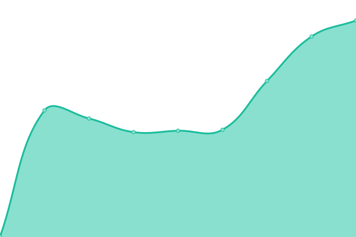

# [📈 Live Status](https://demo.upptime.js.org): <!--live status--> **🟩 All systems operational**

This repository contains the open-source uptime monitor and status page for [Jan](https://demo.upptime.js.org), powered by [Upptime](https://github.com/upptime/upptime).

With [Upptime](https://upptime.js.org), you can get your own unlimited and free uptime monitor and status page, powered entirely by a GitHub repository. We use [Issues](https://github.com/modelrailroader/status-iPad-FAQ/issues) as incident reports, [Actions](https://github.com/modelrailroader/status-iPad-FAQ/actions) as uptime monitors, and [Pages](https://demo.upptime.js.org) for the status page.

<!--start: status pages-->
<!-- This summary is generated by Upptime (https://github.com/upptime/upptime) -->
<!-- Do not edit this manually, your changes will be overwritten -->
<!-- prettier-ignore -->
| URL | Status | History | Response Time | Uptime |
| --- | ------ | ------- | ------------- | ------ |
|  [jans-allerlei.de](https://www.jans-allerlei.de) | 🟩 Up | [jans-allerlei-de.yml](https://github.com/modelrailroader/status-upptime/commits/HEAD/history/jans-allerlei-de.yml) | 

 705ms
     
 | 

<a href="https://status.jans-allerlei.de/history/jans-allerlei-de">99.70%</a>
    

|  [NextCloud](https://cloud.jans-allerlei.de) | 🟩 Up | [next-cloud.yml](https://github.com/modelrailroader/status-upptime/commits/HEAD/history/next-cloud.yml) | 

 1464ms
     
 | 

<a href="https://status.jans-allerlei.de/history/next-cloud">99.44%</a>
    

|  [iPad-FAQ](https://www.melle-gymnasium.de/ipad-faq) | 🟩 Up | [i-pad-faq.yml](https://github.com/modelrailroader/status-upptime/commits/HEAD/history/i-pad-faq.yml) | 

 1383ms
     
 | 

<a href="https://status.jans-allerlei.de/history/i-pad-faq">100.00%</a>
    

<!--end: status pages-->

[**Visit our status website →**](https://demo.upptime.js.org)

## 📄 License

- Powered by: [Upptime](https://github.com/upptime/upptime)
- Code: [MIT](./LICENSE) © [Anand Chowdhary](https://anandchowdhary.com), supported by [Pabio](https://pabio.com)
- Data in the `./history` directory: [Open Database License](https://opendatacommons.org/licenses/odbl/1-0/)
